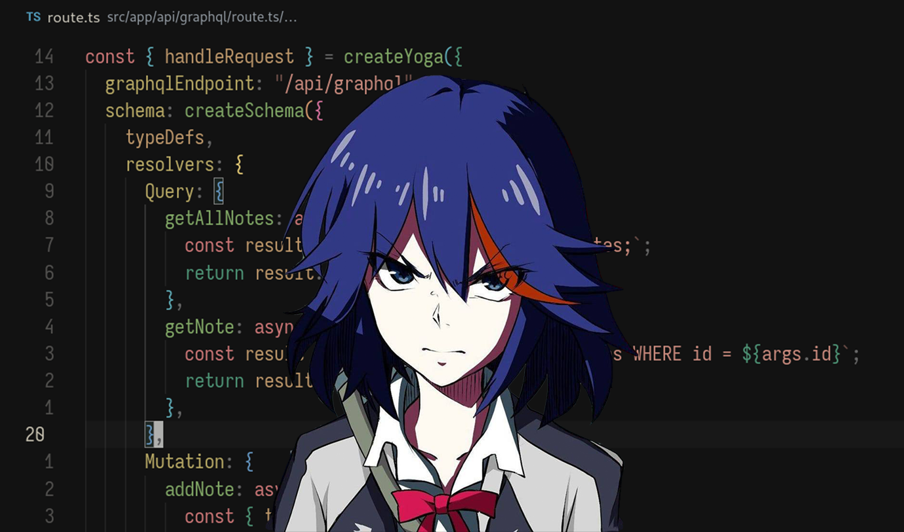

  
  <h1>Ryuko Matoi</h1>
  
A simple Whatsapp bot for personal usage

## Key Features

- Create Sticker from image file.
- Ask to AI.
- Random Anime Quotes.
- Random jokes(more spesifically father jokes).
- Prayer schedule.
- Generate a random daily do'a.
- Generate a random image.
- Edit a background photo color.
- Optical Character Recognition (OCR) from input image.

## Available Commands

- !ask
- !salam
- !info
- !editphoto
- !jadwalsholat
- !jokes
- !image
- !animequote
- !doa
- !ocr

## Technologies

- whatsapp-web.js
- Typescript
- Integration with Open AI, and Remove BG.

## TODO

- Using Gemini instead of OpenAI
- Implement Optical Character Recognition (OCR)

## License

MIT
